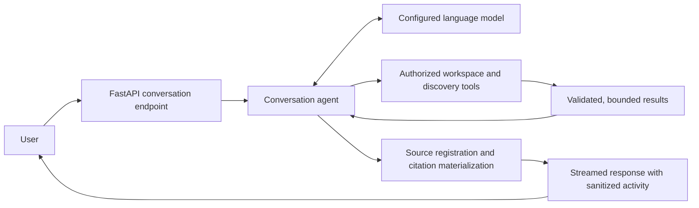

# Server

This server manages the backend for the Scholens project, which allows users to upload, chat with, annotate, and manage research papers in one place.

Shared identity integration follows the
[`sanchezcloud-identity` engineering handbook](https://github.com/EricSanchezok/sanchezcloud-identity/blob/main/docs/README.md).
Scholens-specific ownership is documented in
[`docs/architecture/data-ownership.md`](../docs/architecture/data-ownership.md).

## Prerequisites

- Python 3.12 or higher
- [Uv](https://docs.astral.sh/uv/getting-started/installation/)
- [PostgreSQL database](http://postgresql.org/download/) (Make sure it's running with a user postgres)
- [Docker](https://docs.docker.com/get-docker/) (for RabbitMQ/Redis used by PDF processing and Redis-backed AI capacity limits)
- Jobs service running for uploads and Zotero import (see [jobs/README.md](../jobs/README.md))

## Setup

1. Install dependencies

```bash
uv sync
source .venv/bin/activate
```

2. Set up environment variables from the repository-level catalog. Copy only
   the Server section; the root file is not itself a runtime file.

```bash
touch .env
```

At minimum, point `DATABASE_URL` at a `sanchezcloud` database with migrated
`auth` and `scholens` schemas, then configure only the opt-in model, search,
mail, and storage providers needed for the feature you are exercising. See
[`../DEVELOPMENT.md`](../DEVELOPMENT.md) for the provider catalog, shared-local
account, and AWS RDS distinction.

The backend exposes one versioned capability surface and shares its application
use cases with Agent adapters and the authenticated `/mcp` server. Architecture rules,
resource semantics, transaction ownership, and the replaceable search boundary
are documented in
[`../docs/architecture/backend-capabilities.md`](../docs/architecture/backend-capabilities.md).

Scholight is an automatically authenticated built-in integration. AnySearch,
Tavily, Exa, and Firecrawl are optional user-level connections. Their native MCP
tool schemas and names are discovered dynamically; the runtime does not maintain
a second capability map, provider-specific tool wrappers, or renamed connector
aliases. A connector tool whose native name conflicts with another exposed tool
is omitted explicitly instead of overriding it.

OpenAlex is a separate user-level Connection backed by its official REST API,
not a dynamic MCP connector and not a Server environment credential. The
current actor's encrypted key gates DOI resolution, external paper search,
author works, and citation graphs. Crossref metadata lookup runs first and can
degrade without OpenAlex; upload, arXiv, and direct PDF URL ingestion bypass it.

## Inbound Scholens MCP

`/mcp` is the authenticated Streamable HTTP endpoint for external Agents. Its
fully authorized catalog exposes 56 stored-knowledge and management tools:
paper retrieval, Project and collaborator management, personal Library and
tags, known-source ingestion and jobs, annotation discussions, and existing
research outputs. Narrower Access Keys see only their permitted subset.
Internet paper discovery and research-output generation are intentionally
absent. The in-product Conversation Agent selects 55 of the same definitions;
only the remote upload-preparation primitive is excluded because the in-product
Agent does not own a filesystem.

Every tool publishes a title, decision-oriented description, described input
schema, typed output schema, and truthful MCP behavior annotations. Access Keys
may grant `read`, `write`, `manage`, and `delete`; the tool permission is only a
coarse capability filter and every concrete resource is re-authorized against
the current Actor. MCP resources expose bounded manifests at
`scholens://library`, `scholens://projects`, and typed Project, paper,
annotation-thread, and research-output URIs.

External Agents should call `create_project` or `get_project` once, then store
the returned `binding_markdown` in the research repository. Titles may change;
the returned Project UUID and resource URI are the durable binding. Destructive
or externally visible tools return a state-bound confirmation preview on their
first call and execute only when the same call is repeated with the approved,
unexpired token. Raw confirmation challenges, plaintext share bearer tokens,
and signed upload URLs are never persisted in the invocation replay ledger.

The remote upload primitive accepts only a plain filename, byte count, SHA-256,
and optional Project UUID. It returns a short-lived checksummed object-storage
PUT URL; the client uploads bytes directly and then calls `ingest_paper`. For a
local path, use the official [`mcp-connector`](../mcp-connector/README.md),
which replaces that primitive with `upload_local_paper` and never sends the
path or the Access Key to object storage. Upload claims carry a unique lease
token so an expired worker cannot consume or release a newer claim.

## Start the Application

1. Start the jobs service (RabbitMQ + Celery worker) in a separate terminal:

```bash
cd ../jobs
uv run --frozen --no-sync start
```

2. Start the API server:

```bash
uv run --frozen --no-sync scholens serve
```

The command binds to `127.0.0.1:7301`, rejects any `DATABASE_URL` other than
the shared local PostgreSQL at `127.0.0.1:55432/sanchezcloud`, and does not run
migrations. Apply product migrations explicitly with the `scholens_migrator`
role as documented in [`../DEVELOPMENT.md`](../DEVELOPMENT.md).

## Operator CLI

`scholens` is the only Server command-line entry point. Its command families
are `doctor`, `users`, `entitlements`, `usage`, `jobs`, `db`, `contract`,
`verify`, `maintenance`, and `dev`. Every concrete command accepts `--json`.
Run `uv run scholens <group> --help` for the authoritative option set.

Business mutations execute through `ApplicationExecutor` and the owning
application service, and write CLI provenance to the append-only Operation
Journal. Except for `users bootstrap-admin` and the local-only guarded reset,
mutations require an active verified administrator via `--actor-email` and
confirmation or `--yes`. Entitlement and quota commands also require
`--reason`; those reasons are durable product data. Identity, development, and
maintenance commands do not collect arbitrary prose, and the Journal stores
their structured action/resource projection. SQLAdmin is a read-only diagnostic
surface.

Privileged commands authorize inside their application transaction by locking
the administrator roster, then the actor identity/profile rows, and re-reading
the live status. Admin revoke/block follows the same lock order, so a stale CLI
Actor snapshot cannot outlive a committed privilege reduction.

Passage backfill is a bounded, repeatable runtime operation: `--batch-size`
caps the documents handled by one invocation and transaction. It relies on
normal INSERT permissions and the existing tsvector trigger, never runtime
trigger DDL.

The local broker is `pyamqp://guest@127.0.0.1:55672//` when the Jobs profile is
enabled.

The ordinary Scholens local environment uses an isolated remote dev S3 bucket
and Aliyun DirectMail for real verification, password-reset, and durable Project
invitation messages. It does not require Mailpit or MinIO. Identity owns its
security templates; the Server owns provider-neutral product email and leases
pending invitation delivery from `scholens.project_invitations`. Both use the
same `SCHOLENS_ALIYUN_DM_*` account configuration and `CLIENT_DOMAIN`. Keep
provider credentials in the ignored `server/.env`; Jobs receives the same dev
S3 settings through its own ignored `jobs/.env`. Production RDS, S3, and mail
resources must never be used by local startup.

## API Documentation

FastAPI automatically generates API documentation. Once the application is running, you can access:

- Swagger UI: `http://127.0.0.1:7301/docs`
- ReDoc: `http://127.0.0.1:7301/redoc`

Public application routes are under `/api/v1`; provider webhooks are under
`/webhooks/v1`. `/internal/v1` is reserved for authenticated worker traffic and
is intentionally not routed by the production edge proxy.

Reader composes the existing Document, Research Item, Conversation, and turn
stream capabilities. PDF and parsed-text anchors are discriminated application
contracts, and paper-conversation list cursors are signed against the requested
scope. Do not add Reader aggregation routes, arbitrary position dictionaries,
or browser-side conversation authorization.

Reader content translation uses
`GET|PUT /api/v1/me/translation-preferences` and
`POST /api/v1/papers/{document_id}/selection-translations`. Reflow blocks use
`POST /api/v1/papers/{document_id}/reflow/blocks/{block_id}/translations` and
accept no client source body. Translation emits
standard Server-Sent Events named `start`, `delta`, `complete`, and `error`.
The server re-authorizes the paper before durable-result lookup, persists only
the source hash and translated result, and uses Redis only for capacity and
single-flight coordination. A durable result hit does not consume Token Credits
or provider capacity.

Document reflow is exposed at `GET /api/v1/papers/{document_id}/reflow` and is
requested explicitly with `POST /api/v1/papers/{document_id}/reflow/attempts`.
An active or completed artifact is returned without requiring MinerU; a new or
failed attempt requires the user's enabled MinerU connection. PDF completion
never schedules reflow, and reflow failure never changes the successful PDF
processing state. Callback completion
persists blocks and derived assets only after source fingerprint, ordered source
spans, asset references, and page coordinates validate.
`GET /api/v1/papers/{document_id}/reflow/assets/{asset_id}/url` authorizes the
paper again before returning a short-lived derived-asset URL; object keys remain
private. Reflow is an evidence-bound reading reconstruction over MinerU's
stable structured output, not another metadata authority or a whole-document
model rewrite. Jobs obtains the user-owned token only after claiming an
eligible job; callback outcomes are revision-bound so a late attempt cannot
invalidate a replacement credential.

Conversation turns are created at
`POST /api/v1/conversations/{conversation_id}/turns`; retrying the active branch
leaf
creates another response variant at
`POST /api/v1/conversations/{conversation_id}/turns/{turn_id}/responses`.
Editing any turn on the active path creates an immutable sibling through
`POST /api/v1/conversations/{conversation_id}/turns/{turn_id}/branches`.
`PUT /api/v1/conversations/{conversation_id}/selected-branch` selects a prompt
version, restores its previously selected descendant suffix and authorized
paper context, and returns the authoritative active path. All generation
endpoints complete quota, authorization, context, rate-limit, and concurrency
preflight before product mutation. Branch acceptance uses one short transaction
to restore the source paper-context snapshot, create the Turn and Response,
switch the selected path, and increment its revision. Preflight rejection has no
Conversation mutation; after acceptance, `start` is necessarily the first SSE
event and any later failure is a persisted terminal response. Reusing a Turn ID
is idempotent only when every immutable input and its tree position match;
otherwise the whole acceptance command returns `conversation_turn_conflict`.
Selecting the already-active branch is a storage and journal no-op. Consumers
must handle the typed `start`, `assistant_item_start`, `assistant_item_delta`,
`assistant_item_complete`, `activity`, `references`, `response_ready`,
`suggestions`, `complete`, and `error` events and treat `complete` or `error`
as terminal. `response_ready` carries the complete persisted turn snapshot and
unblocks response actions; `suggestions` is an optional late sidecar update.
Assistant items begin as
provisional and are authoritatively classified on completion as `progress` or
`final`; clients move the same stable item instead of duplicating its text.
Progress and activity entries share a monotonic sequence. Requests include the
UI locale and a validated IANA time zone. `activity` contains only a sanitized
category/state/subject projection and intentionally omits the raw tool name.
Model reasoning, provider heartbeats, tool arguments, and tool payloads are
never part of the public stream. References may be emitted only for the final
assistant item. The runtime passes these same typed event models to the HTTP
adapter rather than maintaining a second dictionary-shaped protocol. Completed
assistant items must contain visible text; user-visible progress is bounded to
4,000 characters, and a response without a visible final answer is failed
instead of persisting an empty response variant. A turn owns the immutable user
prompt, typed paper-context snapshot, and one or more generated responses.
Parent and selected-child pointers form a persistent tree, while the
Conversation selects one root and publishes a monotonic path revision. Agent
history contains only the generated turn's selected ancestors. Only the active
leaf may be retried or switch its selected response, and only one response may
run in a Conversation at a time. Creating a normal next turn prunes unselected
response variants from its parent; prompt branches are never pruned as a side
effect. The active leaf may own persisted follow-up suggestions. Suggestion generation
starts beside the answer stream and shares the same SSE instead of requiring a
second HTTP request or polling. It uses no open database transaction while the
model runs and rechecks active-leaf ownership before persisting. The structured
result is exactly three unique questions:
one deepening question, one comparison or verification question, and one
practical-application question. Only the current query, locale, three recent
selected turns, and authorized scope display titles enter that prompt; the
current answer, trace data, raw tool output, and document bodies never do. A
newer turn clears the preceding suggestions, and a late result cannot restore
them. Suggestions and first-title generation never block `response_ready`; the
stream retains a bounded two-second sidecar tail before `complete`.
Completed, failed, and cancelled responses persist their total `duration_ms`;
the latest terminal attempt remains selected, and the active leaf serializes
all terminal attempts so failure/cancellation and retry survive refresh. Raw
exception text remains private diagnostics. The ordered trace remains separate
inspectable progress rather than a timing store.
There is no private delimiter. Clients may abort the request, but must not
automatically retry this non-idempotent operation.

Paper ingestion has a separate operation-scoped idempotency contract. Staged
PDF uploads and DOI/arXiv/direct-PDF sources return `202` only after the canonical Library
ingestion row, durable job, and outbox dispatch are committed. If the browser
loses that response, it reconciles or repeats the same parameters with the same
`Idempotency-Key`; it must not create a second operation. The Papers list
returns completed papers and active/failed ingestions as one discriminated
collection, with exactly one lifecycle row per personal membership: an active
or failed ingestion replaces that paper's completed projection until it reaches
a terminal success state. The Library summary reports successful papers
separately from current and failed ingestions, and unattached reservations stay
visible at the beginning of the first forward page. PDF content SHA-256 is the server-side duplicate
authority, including concurrent requests. `DELETE
/api/v1/paper-ingestions/{job_id}` cancels an owned ingestion, and late worker
callbacks cannot restore it.

DOI source ingestion validates the identifier before requiring the current
actor's enabled OpenAlex connection. It accepts only an open PDF location from
that catalog and returns stable credential, rate-limit, or availability errors
without substituting an MCP or general web-search result. A catalog `404` or a
work with no open PDF retains the existing source-unavailable/not-found
semantics.

Zotero is a separate read-only integration under
`/api/v1/integrations/zotero`. `POST .../oauth/authorizations` starts a
short-lived OAuth session for a validated local return path and `manage` or
`import` intent. The callback consumes its encrypted request-token secret once,
verifies `/keys/current`, and requires personal-library, files, and notes read
access. Zotero may attach additional write or Group Library privileges to the
issued key; their presence does not reject the connection, while Scholens still
uses only personal-library read endpoints and never writes through them. Status,
preferences, collections, library items, import operations, and sync runs use
stable public DTOs; raw provider exceptions and credentials are never public.

Collection and library browsing perform remote I/O outside an application
transaction, enforce Zotero's 100-item page ceiling, and bind opaque cursors to
the user and complete query. Each provider call owns and explicitly closes its
HTTP session on both success and failure. Collection cursors remain available
beyond the first page. PDF availability is determined from complete, bounded
child pages for only the currently visible items; a safety-limit hit fails
explicitly instead of reporting an unscanned PDF as unavailable. Import and
sync mutations only commit a
`ZoteroOperation`, DurableJob, and dispatch outbox before returning `202`.
The connection row is locked during acceptance, so each user has at most one
active Zotero import or sync; status returns its kind and ID for refresh-safe
polling and cancellation.
Workers retrieve a current revision-scoped API key through the signed internal
API, then return item-level signed callbacks. The Server creates standard paper
ingestions, applies annotations idempotently by Zotero annotation key, and
ignores late credential failures or callbacks from a disconnected/replaced
revision. Disconnecting retains imported papers, annotations, and operation
history.
Before processing a callback, Server atomically claims an expiring callback
lease. Terminal, cancelled, concurrent, and replayed deliveries make no
connection, paper, annotation, journal, or storage mutation. Canonical
eight-character Zotero keys and bounded metadata/annotation callback payloads
are enforced at both public and internal boundaries.
The aggregate callback ceiling is the shared 12 MiB compact-JSON contract.
Jobs stops constructing manual or sync results before that bound; Server still
validates it before any product mutation. Annotation-budget exhaustion leaves
unreported sync targets unattempted, while a reserved automatic-import share
prevents a large annotation front page from starving prospective imports.
Import callbacks plan deduplication and quota decisions before downloading any
staged content, then consume one PDF at a time. A 50-paper operation therefore
holds at most one 30 MiB provider PDF payload in the API process. The callback
renews its 15-minute claim every 30 seconds, has a 12-minute processing bound,
and rechecks the claim after download, after ingestion-capacity acquisition,
and before each persistent mutation. Claim loss releases an acquired permit
without uploading or accepting that paper.

Server deletes `zotero-imports/` staging only after a callback has a definite,
owned result. Processing timeout, request cancellation, lease loss, or an
unknown HTTP delivery outcome preserves staging for retry or the bucket's
two-day lifecycle. A canonical `documents/{sha256}/source.pdf` upload cannot
stop its underlying thread when the callback is cancelled. Server retains an
explicit task reference until that write settles without delaying the callback
processing bound or treating the write as cleaned up. A completed but
unreferenced content-addressed write is safe to reuse; reclamation belongs to
reference-aware Server document storage reconciliation, never eager callback
cleanup that could delete another ingestion's source.

A manual sync inspects only already imported papers. Researcher scheduling
automatically syncs their annotations and may also import later Zotero items
when the user has explicitly enabled auto import. Enabling it records the
current Zotero library version. Incremental work persists a bounded secondary
page position, processes no more than 50 items per run, and advances only
through a contiguous prefix of accepted or permanently skipped items. Rate
limits, temporary downloads, and quota failures are retried rather than being
skipped by the checkpoint.
Loss of Researcher access pauses the preference without clearing it.
Annotation scheduling orders by the last attempt so failed targets cannot
starve later papers. Failures update attempt time but never successful-sync
time; confirmed missing remote items or attachments disable future automatic
annotation polling for that link while retaining the local paper.

The PDF completion callback persists extracted metadata, generated summary,
and summary citations on the canonical `Document`. Ingestion never creates a
Conversation, Turn, or Response. A paper-scoped conversation begins only from
an explicit user action and reads the existing Document-owned context.

# Migrations

This project uses Alembic for database migrations. Commands are run through the
locked `uv` environment:

```bash
uv run alembic revision --autogenerate -m "migration message"
```

To apply the migration, run:

```bash
uv run scholens db upgrade
```

To downgrade the migration, run:

```bash
uv run alembic downgrade -1
```

Before committing a migration, run `uv run alembic check` and
`uv run scholens db status`. Alembic compares
only the `scholens` schema; `auth` belongs to sanchezcloud-identity and other product
schemas are deliberately outside this migration environment. The local
product-only reset procedure is documented in
[`DEVELOPMENT.md`](../DEVELOPMENT.md#reset-only-the-local-product-schema).

# Tests

Run the complete Server quality gate from the repository root. The runner has
no dependency-installation, migration, or persistent service-startup side
effects:

```bash
./scripts/run-gates.sh server
```

The equivalent service-local checks are:

```bash
uv run ruff format --check app tests migrations
uv run ruff check app tests migrations
uv run mypy app
uv run pytest -q
```

The root gate and CI additionally reject known debug and superseded import
patterns in Server business code. Use `uv run ruff format app tests migrations`
deliberately when formatting; verification commands never rewrite source.

## Chat with Knowledge Base

The Home conversation surface can ask questions across the authorized knowledge
base. AI-generated responses carry validated inline citations that open the
source panel; paper and Reader context use the canonical typed source and anchor
contracts described above.

The response agent is one contextual Pydantic AI runtime with access to the
authorized subset of the canonical workspace and connector tools:

- `search_scholens_knowledge` for papers, passages, annotations, comments, and
  existing outputs already accessible in the selected Scholens scope
- connector-native discovery tools such as Scholight's `search_papers` for
  finding external literature
- `get_paper_content`
- `search_paper_content`
- workspace management tools selected from the same catalog exposed by `/mcp`

Unified Conversation agent workflow:


