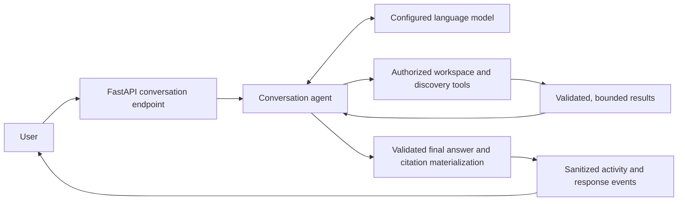

# Server

This server manages the backend for the Scholens project, which allows users to upload, chat with, annotate, and manage research papers in one place.

Shared identity integration follows the
[`sanchezcloud-identity` engineering handbook](https://github.com/EricSanchezok/sanchezcloud-identity/blob/main/docs/README.md).
Scholens-specific ownership is documented in
[`docs/architecture/data-ownership.md`](../docs/architecture/data-ownership.md).

## Prerequisites

- Python 3.12 or higher
- [Uv](https://docs.astral.sh/uv/getting-started/installation/)
- [PostgreSQL database](http://postgresql.org/download/) (Make sure it's running with a user postgres)
- [Docker](https://docs.docker.com/get-docker/) (for RabbitMQ/Redis used by PDF processing and Redis-backed AI capacity limits)
- Jobs service running for uploads and Zotero import (see [jobs/README.md](../jobs/README.md))

## Setup

1. Install dependencies

```bash
uv sync
source .venv/bin/activate
```

2. Set up environment variables from the repository-level catalog. Copy only
   the Server section; the root file is not itself a runtime file.

```bash
touch .env
```

At minimum, point `DATABASE_URL` at a `sanchezcloud` database with migrated
`auth` and `scholens` schemas, then configure only the opt-in model, search,
mail, and storage providers needed for the feature you are exercising. See
[`../DEVELOPMENT.md`](../DEVELOPMENT.md) for the provider catalog, shared-local
account, and AWS RDS distinction.

The backend exposes one versioned capability surface and shares its application
use cases with Agent adapters and the authenticated `/mcp` server. Architecture rules,
resource semantics, transaction ownership, and the replaceable search boundary
are documented in
[`../docs/architecture/backend-capabilities.md`](../docs/architecture/backend-capabilities.md).

Scholight is an automatically authenticated built-in integration. AnySearch,
Tavily, Exa, and Firecrawl are optional user-level connections. Their native MCP
tool schemas and names are discovered dynamically; the runtime does not maintain
a second capability map, provider-specific tool wrappers, or renamed connector
aliases. A connector tool whose native name conflicts with another exposed tool
is omitted explicitly instead of overriding it.

OpenAlex is a separate user-level Connection backed by its official REST API,
not a dynamic MCP connector and not a Server environment credential. The
current actor's encrypted key gates DOI resolution, external paper search,
author works, and citation graphs. Crossref metadata lookup runs first and can
degrade without OpenAlex; upload, arXiv, and direct PDF URL ingestion bypass it.

## Inbound Scholens MCP

`/mcp` is the authenticated Streamable HTTP endpoint for external Agents. Its
fully authorized catalog exposes 63 stored-knowledge and management tools:
paper retrieval, Project and collaborator management, personal Library and
tags, known-source ingestion and jobs, annotation discussions, and existing
research outputs. Narrower Access Keys see only their permitted subset.
Internet paper discovery and research-output generation are intentionally
absent. The in-product Conversation Agent also selects 63 definitions: it
excludes the remote upload-preparation primitive because it does not own a
filesystem and instead includes the internal-only `wait_for_jobs` tool.

Every tool publishes a title, decision-oriented description, described input
schema, typed output schema, and truthful MCP behavior annotations. Access Keys
may grant `read`, `write`, `manage`, and `delete`; the tool permission is only a
coarse capability filter and every concrete resource is re-authorized against
the current Actor. MCP resources expose bounded manifests at
`scholens://library`, `scholens://projects`, and typed Project, paper,
annotation-thread, and research-output URIs.

Six complete-object or full-page reads remain available as owned rolling-
compatibility contracts: `get_paper`, `get_library_paper`,
`get_annotation_thread`, `get_research_output`, `list_library_papers`, and
`list_research_outputs`. New integrations and every Resource continuation use
their bounded replacements: `get_paper_page`, `get_library_paper_page`,
`get_annotation_thread_page`, `get_research_output_page`,
`list_library_paper_summaries`, and `list_research_output_summaries`. The four
single-object replacements return lossless UTF-8 pages of canonical JSON; the
list replacements use signed keyset pagination and bounded previews. Library
paper pages exclude rotating signed preview URLs from durable JSON and expose
the current URL separately; a revision-keyed bounded LRU serializes each
multi-page paper, Library paper, annotation, or research-output representation
once. Canonical JSON above the explicit 64 MiB per-document ceiling fails with
`json_document_paging_limit_exceeded` instead of falling back to quadratic
re-serialization. The legacy names, owners, replacement
names, telemetry keys, and earliest removal dates are governed by
`contracts/deprecations.json`.

Annotation-thread and research-output Resource manifests use one exact,
authorized SQL catalog row and never hydrate the complete thread, comments,
transcript, or table. Full-page reads first obtain an authoritative nested
revision and a conservative persisted-content serialization bound; an item
above the retained ceiling is rejected before ORM hydration. Cache misses are
per-key singleflight operations, and distinct builds reserve the global cache
budget before they hydrate or serialize, so concurrent misses cannot multiply
the configured retained-memory ceiling. MCP annotation updates likewise return
a bounded scalar summary; the HTTP update contract remains complete.
Paper Resource manifests likewise avoid complete producers: canonical metadata
comes from an authorized, fixed-width scalar projection, and extracted text
comes from a database `left(...)` prefix plus scalar line/count facts. A
Resource read therefore never hydrates the complete metadata object or the
64 MiB lossless text snapshot merely to emit its 16 KiB preview. Cross-module
Project lookups must choose an explicit citation, capacity, or storage-reference
`Document` column profile; none of those paths may lazy-load parsed content or
unrelated metadata arrays.

Extracted-text continuations and regex-search pages likewise revalidate current
document access through a lightweight revision query on every call. A separate
actor-and-revision-keyed LRU retains at most 128 MiB overall and 64 MiB per
paper, including the text digest and sparse line checkpoints, so complete reads
do not repeatedly hydrate, split, or hash the same large text. An entry above
that ceiling fails with `paper_content_paging_limit_exceeded`; content revision
changes invalidate the signed continuation instead of serving mixed versions.
Concurrent requests for one actor/document/revision share one hydration and
index build. Distinct builds reserve their maximum retained size against the
global cache before reading the complete text. The paper and canonical-JSON
caches share one singleflight-LRU kernel; it separately reserves bounded build
working memory, rejects recursive same-key factories, and releases both
reservations after factory failures. Regex search operates on line spans in the
immutable source instead of copying complete lines, builds only a fixed-size
match preview, and shares a process-level concurrency limit even on cache hits.
Strict Unicode validation and JSON-prefix sizing likewise use bounded temporary
allocations rather than serializing an entire historical text value first.

Runtime tool errors (`isError: true`) carry the full JSON error
(code/kind/message/retryable/remediation/diagnostic ID) only in the content
text and intentionally omit `structuredContent`, so strict MCP clients skip
schema validation of errors and always surface the original Scholens error
code instead of a `-32602` schema-validation failure. The advertised
`outputSchema` keeps its structured error branch for compatibility.

Authenticated Job callbacks that fail the registered operation contract are
atomically marked failed before their Redis concurrency leases are released.
Unexpected handler or database failures keep their leases until retry or TTL,
so error handling cannot admit duplicate active work.
Signed worker callbacks use one shared Jobs/Server byte contract and are
rejected above a 64 MiB request-body ceiling. PDF parser output is additionally
bounded to 40 MiB of UTF-8 canonical text (the 125% repair-candidate ceiling)
and 2 MiB of encoded page offsets. Jobs validates the exact encoded callback
before opening the HTTP request; Server checks a declared `Content-Length`
before reading and then stops a chunked body at the first over-limit chunk.
Internal callback routes deliberately declare no eager FastAPI body field: they
parse only the bounded bytes cached by authentication after signature
verification. A lost-control worker therefore cannot allocate or persist an
unbounded result before the transport limit runs.

Transactional generated-object cleanup uses a second shared Jobs contract.
Only ASCII-safe keys under `documents/` or `research/audio/` are eligible, each
key is at most 1,024 UTF-8 bytes, and a durable deletion batch is capped at both
100 strictly ordered unique keys and 64 KiB of compact key JSON. Project and
Document producers use deterministic keyset-ordered streams; the shared
batcher retains only the previous key and current batch, and rejects duplicates
or ordering drift across batch boundaries. Each idempotency key includes its
ordinal and key digest, and Server accepts completion only when the signed
deleted-count receipt matches the persisted batch exactly. Newly created Job
IDs are re-read by origin operation in bounded pages so every `job.created`
journal fact is preserved without materializing the whole cleanup plan.

External Agents should call `create_project` or `get_project` once, then store
the returned `binding_markdown` in the research repository. Titles may change;
the returned Project UUID and resource URI are the durable binding. Destructive
or externally visible tools return a state-bound confirmation preview on their
first call and execute only when the same call is repeated with the approved,
unexpired token. Raw confirmation challenges, plaintext share bearer tokens,
and signed upload URLs are never persisted in the invocation replay ledger.

The remote upload primitive accepts only a plain filename, byte count, SHA-256,
and optional Project UUID. It returns a short-lived checksummed object-storage
PUT URL; the client uploads bytes directly and then calls `ingest_paper`. For a
local path, use the official [`mcp-connector`](../mcp-connector/README.md),
which replaces that primitive with `upload_local_paper` and never sends the
path or the Access Key to object storage. Upload claims carry a unique lease
token so an expired worker cannot consume or release a newer claim.

`ingest_paper`, `retry_paper_ingestion`, `ingest_papers`, and `get_job` accept
`wait_seconds` with a 30-second default and a 240-second maximum. They return
immediately when every observed job is terminal; otherwise they return the
latest durable snapshots with machine-readable next-action guidance at the
deadline. `0` requests an immediate snapshot. Batch ingestion accepts at most
50 known sources, limits acceptance to four concurrent operations and one
45-second wall-clock budget, then observes all accepted jobs under one shared
deadline. The Conversation-only `wait_for_jobs` defaults to 120 seconds and can
observe up to 50 active jobs in one call. Waiting uses short owner-scoped reads
with capped backoff and never retains a database transaction between reads.

Project collection tools preserve their established inputs and item fields but
return MCP-specific bounded summaries. `list_projects` and
`list_paper_projects` return at most 25 rows; `list_project_papers` returns at
most 10. Large descriptions, abstracts, summaries, names, and metadata lists
are JSON-byte-safe previews, with explicit `content_truncated` and `guidance`
fields directing callers to `get_project` or `get_paper_page`. Existing signed
continuations expose remaining rows, and HTTP Project reads remain complete.

`list_project_members` retains its 50-row input maximum but JSON-byte-bounds
mutable display names and replaces only unsupported oversized historical email
values with an explicit placeholder while preserving immutable user IDs.
Member update/removal authorizes and fetches the exact target directly; update
and ownership-transfer completions return compact ID/permission receipts rather
than duplicating collaborator identities or the complete Project.

`list_annotation_threads` accepts its existing page-size range but returns at
most 50 source-ordered summaries from a database keyset page. Its signed cursor
binds the actor, filters, and ordering. List rows retain `comment_count`, omit
comment bodies, and bound quote and PDF-anchor previews; callers use
`get_annotation_thread_page` for the complete discussion. The HTTP Reader list
continues to return its complete thread timelines.

Agent-facing Job snapshots are a public status projection: the compatibility
schema retains `result: object | null`, but the MCP runtime value is always
`null`. Status reads do not select the Job `payload` or `result` JSON columns,
and completed work is continued through returned paper, Project, or research
output identifiers and resources. The HTTP Jobs API retains its complete
result contract for existing product consumers. `list_jobs` defaults to 20
items, accepts at most 50, and uses an actor-and-filter-bound signed keyset
cursor over `(created_at, id)`. Ingestion actions are compact receipts rather
than copies of the response. A batch receipt preserves input order; an
oversized source is represented by a UTF-8-safe preview with
`source_truncated: true`, which must not be reused as ingestion input.

The shared dispatcher applies each tool's public projection before output
validation, replay persistence, and delivery, and reapplies it to legacy replay
rows. The 200 KiB default budget measures the complete serialized MCP
`CallToolResult` result object: its unescaped-Unicode compatibility text,
`structuredContent`, and standalone `ResourceLink` blocks. The surrounding
JSON-RPC version and request ID are excluded. Job tools use tighter budgets:
32 KiB for a single Job, 64 KiB for a Job page, 96 KiB for multi-Job waiting,
and 192 KiB for batch ingestion. An over-budget result fails with
`tool_result_budget_exceeded` instead of emitting an unbounded response.

## Start the Application

1. Start local RabbitMQ and Redis:

```bash
docker compose -f ../jobs/compose.local.yaml up -d rabbitmq redis
```

2. Start the Server-owned Conversation worker in a separate terminal:

```bash
uv run --frozen --no-sync celery \
  --app app.modules.conversations.infrastructure.celery_app worker \
  --loglevel=info --concurrency=1 --queues=conversation \
  --without-gossip --without-mingle
```

3. Start the optional Jobs service when testing uploads or other Jobs-owned
   queues:

```bash
cd ../jobs
uv run --frozen --no-sync start
```

4. Start the API server:

```bash
uv run --frozen --no-sync scholens serve
```

The command binds to `127.0.0.1:7301`, rejects any `DATABASE_URL` other than
the shared local PostgreSQL at `127.0.0.1:55432/sanchezcloud`, and does not run
migrations. Apply product migrations explicitly with the `scholens_migrator`
role as documented in [`../DEVELOPMENT.md`](../DEVELOPMENT.md).

## Operator CLI

`scholens` is the only Server command-line entry point. Its command families
are `doctor`, `users`, `entitlements`, `usage`, `jobs`, `db`, `contract`,
`verify`, `maintenance`, and `dev`. Every concrete command accepts `--json`.
Run `uv run scholens <group> --help` for the authoritative option set.

Business mutations execute through `ApplicationExecutor` and the owning
application service, and write CLI provenance to the append-only Operation
Journal. Except for `users bootstrap-admin` and the local-only guarded reset,
mutations require an active verified administrator via `--actor-email` and
confirmation or `--yes`. Entitlement and quota commands also require
`--reason`; those reasons are durable product data. Identity, development, and
maintenance commands do not collect arbitrary prose, and the Journal stores
their structured action/resource projection. SQLAdmin is a read-only diagnostic
surface.

Privileged commands authorize inside their application transaction by locking
the administrator roster, then the actor identity/profile rows, and re-reading
the live status. Admin revoke/block follows the same lock order, so a stale CLI
Actor snapshot cannot outlive a committed privilege reduction.

Passage backfill is a bounded, repeatable runtime operation: `--batch-size`
caps the documents handled by one invocation and transaction. It relies on
normal INSERT permissions and the existing tsvector trigger, never runtime
trigger DDL.

`dev seed-test-account` is the local Identity-fixture exception. It is explicit,
never part of Server startup, accepts only reserved synthetic addresses, and
refuses production or any database other than the registered shared-local
runtime target. Identity creation, verification, and password replacement go
through the pinned SanchezCloud Identity SDK; Scholens creates only its owned
product profile and optional first administrator state through application
services. Matching credentials remain unchanged so repeat runs do not revoke a
working browser session.

`dev seed-test-fixture` is the companion product fixture. Run it only after
the product schema is at migration `head`; it uploads the committed CC BY 4.0
evaluation PDFs to the isolated local-development S3 bucket and creates an
idempotent Library/Project fixture for the selected synthetic account. It does
not create or modify Identity users and is never invoked by `serve`.

Paper search defaults to `PAPER_SEARCH_BACKEND=postgres_hybrid`. It combines
compact exact/trigram matching, weighted PostgreSQL full text, and the pinned
local multilingual embedding model at `SCHOLENS_EMBEDDING_MODEL_PATH`; no query
or paper text is sent to a model provider. `postgres_fts` selects the same
authorization-first lexical lanes without semantic retrieval. A missing or
unavailable model degrades a request to lexical results.

Existing or stale semantic projections are maintained with a bounded dry-run
first:

```bash
uv run scholens maintenance backfill-search-embeddings --batch-size 100 --json
uv run scholens maintenance backfill-search-embeddings --batch-size 100 --apply --yes --json
uv run scholens maintenance backfill-conversation-titles --actor-email admin@example.com --batch-size 100 --json
uv run scholens maintenance backfill-conversation-titles --actor-email admin@example.com --batch-size 100 --apply --yes --json
```

Repeat the apply command until `candidates` reaches zero. The projection is
versioned and digest-bound, so a model or source-text change is reindexed
without rewriting canonical Document content.

The `maintenance fix-annotation-offsets` and
`maintenance reprocess-contaminated-documents` repairs are also bounded and
dry-run by default. They act only on locally provable candidates: a unique
verbatim quote for reanchoring, or the current completed PDF job whose result
object key conflicts with its canonical Document. `--apply` and normal operator
confirmation are required for writes.

`maintenance reprocess-replacement-character-documents` is the targeted
Unicode-text repair. Run the consumer-first release in this order: deploy Jobs
with the dedicated `repair_pdf_text` task, deploy Server, run a dry-run, then
apply one operator-reviewed batch. The default batch is 25 and the hard maximum
is 50. Selection transfers only identifiers and text byte counts, keyset-scans
at most four times the requested batch, locks apply candidates with `SKIP
LOCKED`, materializes one document at a time, and caps work at 32 MiB per
document and 64 MiB per invocation. Run one operator invocation at a time and
repeat dry-run/apply only after the previous repair Jobs are terminal.

Each repair is bound to the current source Job, canonical text SHA-256, repair
revision, and attempt. A pending or running attempt is not duplicated; a
completed outcome closes its source generation, and an applied outcome closes
that Document's revision; failed or cancelled outcomes may be retried up to
three total attempts. `scholens_job_contracts` is the single owner of that
attempt ceiling and of the U+FFFD warning, content-ratio thresholds, and
bounded evidence-comparison algorithm used by both Jobs fallback selection and
Server callback adoption. Evidence windows must retain source order, so a parser
that reverses columns or paragraphs is rejected even when every sampled phrase
is still present. Repair candidates are capped at 40 MiB UTF-8, and annotation
reanchoring has explicit thread, quote-byte, position-JSON-byte, and scan-work
ceilings. Scalar database facts are checked before historical quote/position
values are hydrated; exceeding a ceiling safely keeps the prior canonical text.
Apply output distinguishes `candidates`,
`enqueued`, `skipped`, and `work_bytes`; `sample_job_ids` contains the newly
created repair Job IDs, never the source IDs. The dedicated Job receives only
the canonical S3 source key and short-lived internal callback, claim, progress,
and MinerU-credential URLs. Credentials are not stored in the payload. Repair
Jobs share the bounded Document queue but are hidden from requester-facing Job
list/get/wait/cancel/retry surfaces; operators can inspect them with the
read-only `scholens jobs` commands. They are document-global maintenance
records and deliberately carry no Project foreign key, even when the historical
source Job was project-scoped. This keeps their lock graph compatible with
Project deletion's canonical Project-before-Document order while requester
identity and source provenance remain bound by the repair payload and source
Job. Stopping further CLI invocations is the
rollback switch: failed, cancelled, unsafe, or non-improving repairs keep the
previous canonical text readable. Terminal non-applied callbacks transactionally
enqueue deletion of the exact versioned candidate namespace; applied callbacks
delete superseded parser artifacts. Durable repair Job results contain only a
bounded digest/count/parser/outcome summary, never candidate text or page maps.
Final Document GC includes every strictly derived repair artifact key and
sanitizes any legacy repair result before the Document foreign key is cleared.

`maintenance recover-stuck-paper-ingestion --job-id <uuid>` is the dry-run-first
incident command for one PDF dispatch that is still pending after publication.
It requires at least a one-hour age by default, preserves existing Library and
Project membership and quota ownership, marks the lost source task failed, and
enqueues one idempotent replacement. The API dispatcher applies the same rule
automatically after `JOB_UNCLAIMED_TIMEOUT_SECONDS`; a replacement is never
automatically replaced a second time, so repeated infrastructure failure becomes
an explicit retryable ingestion failure instead of an unbounded job chain.

The local broker is `pyamqp://guest@127.0.0.1:55672//` when the Jobs profile is
enabled.

The ordinary Scholens local environment uses an isolated remote dev S3 bucket
and Aliyun DirectMail for real verification, password-reset, and durable Project
invitation messages. It does not require Mailpit or MinIO. Identity owns its
security templates; the Server owns provider-neutral product email and leases
pending invitation delivery from `scholens.project_invitations`. Both use the
same `SCHOLENS_ALIYUN_DM_*` account configuration and `CLIENT_DOMAIN`. Keep
provider credentials in the ignored `server/.env`; Jobs receives the same dev
S3 settings through its own ignored `jobs/.env`. Production RDS, S3, and mail
resources must never be used by local startup.

The `scholens dev seed-test-fixture` command is stricter than ordinary local
startup because it uploads deterministic PDFs: it requires `S3_BUCKET_NAME` to
match the documented `scholens-dev-*` naming convention and requires
`AWS_ENDPOINT_URL_S3` to be empty. It rejects the command before any upload
when either storage guard fails.

## API Documentation

FastAPI automatically generates API documentation. Once the application is running, you can access:

- Swagger UI: `http://127.0.0.1:7301/docs`
- ReDoc: `http://127.0.0.1:7301/redoc`

Public application routes are under `/api/v1`; the unified conversation stream
also exposes the versioned `/api/v2/conversations` surface. Provider webhooks
are under `/webhooks/v1`. `/internal/v1` is reserved for authenticated worker
traffic and is intentionally not routed by the production edge proxy.

Reader composes the existing Document, Research Item, Conversation, and turn
stream capabilities. PDF and parsed-text anchors are discriminated application
contracts, and paper-conversation list cursors are signed against the requested
scope. Do not add Reader aggregation routes, arbitrary position dictionaries,
or browser-side conversation authorization.

Reader content translation uses
`GET|PUT /api/v1/me/translation-preferences` and
`POST /api/v1/papers/{document_id}/selection-translations`. Reflow blocks use
`POST /api/v1/papers/{document_id}/reflow/blocks/{block_id}/translations` and
accept no client source body. Translation emits
standard Server-Sent Events named `start`, `delta`, `complete`, and `error`.
The server re-authorizes the paper before durable-result lookup, persists only
the source hash and translated result, and uses Redis only for capacity and
single-flight coordination. A durable result hit does not consume Token Credits
or provider capacity. The provider receives the paper title as non-translated
domain context and the exact source in an untrusted data envelope. Its
revisioned academic prompt prioritizes claim fidelity and established
terminology, protects notation and citations, conservatively removes only
unmistakable PDF-selection furniture or reading-order intrusions, and disables
that cleanup for server-owned reflow blocks.

Document reflow is exposed at `GET /api/v1/papers/{document_id}/reflow` and is
requested explicitly with `POST /api/v1/papers/{document_id}/reflow/attempts`.
An active or completed artifact is returned without requiring MinerU; a new or
failed attempt requires the user's enabled MinerU connection. PDF completion
never schedules reflow, and reflow failure never changes the successful PDF
processing state. Callback completion
persists blocks and derived assets only after source fingerprint, ordered source
spans, asset references, and page coordinates validate.
`GET /api/v1/papers/{document_id}/reflow/assets/{asset_id}/url` authorizes the
paper again before returning a short-lived derived-asset URL; object keys remain
private. Reflow is an evidence-bound reading reconstruction over MinerU's
stable structured output, not another metadata authority or a whole-document
model rewrite. Jobs obtains the user-owned token only after claiming an
eligible job; callback outcomes are revision-bound so a late attempt cannot
invalidate a replacement credential.

Conversation turns are created at
`POST /api/v2/conversations/{conversation_id}/turns`; retrying the active branch
leaf creates another response variant at
`POST /api/v2/conversations/{conversation_id}/turns/{turn_id}/responses`.
Editing any turn on the active path creates an immutable sibling through
`POST /api/v2/conversations/{conversation_id}/turns/{turn_id}/branches`.
`POST /api/v2/conversations/{conversation_id}/start` atomically creates a
client-identified Conversation and accepts its first Turn/Response, so a first
prompt never commits an empty Conversation in a separate request. Replaying the
same immutable Turn/Response request returns its existing generation even after
the Conversation title or current context changes; conflicting Turn, Response,
query, contexts, reasoning, locale, or time-zone reuse returns
`conversation_start_conflict`. Mutable title, current scope/context, and tool
permissions are not replay identity; the originally accepted scope is recovered
from the durable job's project/document ownership.
`PUT /api/v1/conversations/{conversation_id}/selected-branch` selects a prompt
version, restores its previously selected descendant suffix and authorized
paper context, and returns the authoritative active path. All generation
endpoints complete quota, authorization, context, rate-limit, and concurrency
preflight before product mutation. Branch acceptance uses one short transaction
to restore the source paper-context snapshot, create the Turn and Response,
switch the selected path, and increment its revision. Preflight rejection has no
Conversation mutation; after acceptance, `start` is necessarily the first typed
SSE event and any later failure is a persisted terminal response. Reusing a Turn ID
is idempotent only when every immutable input and its tree position match;
otherwise the whole acceptance command returns `conversation_turn_conflict`.
Clients that send `Prefer: respond-async` receive `202` only after the running
Response, DurableJob, and outbox dispatch commit atomically. The dedicated
Server-owned `conversation` worker then generates outside the browser request.
Without that preference, the same endpoint returns a direct durable SSE
subscription to the accepted generation: a comment-only `: accepted` frame
flushes the response before subscription preparation, followed by the Redis-ID
typed events. It never runs the agent in the HTTP request. The v2 stream at
`GET /api/v2/conversations/{conversation_id}/turns/{turn_id}/responses/{response_id}/events`
replays the bounded Redis event log from `Last-Event-ID` and reconciles terminal
state from PostgreSQL; Redis is never canonical. Route changes, mobile
backgrounding, reload, and connectivity loss therefore detach only a subscriber.
`POST .../responses/{response_id}/cancel` is the sole user cancellation boundary
and conditionally cancels both Response and job.
Selecting the already-active branch is a storage and journal no-op. The v2
consumer receives one ordered envelope family: `turn.started`, `phase.updated`,
sanitized `message.part.updated` activity/progress, `message.part.delta`,
`message.part.reset`, `message.part.completed`, `references.ready`,
`response.ready`, optional `suggestions.ready`, and the terminal
`turn.completed`, `turn.canceled`, or `turn.failed`. Each envelope carries a
response-local sequence and a replay cursor; raw tool names, arguments, payloads,
provider heartbeats, and model reasoning never leave the server. Candidate text
is provisional and resettable, while `response.ready` carries the complete
persisted turn snapshot and unblocks response actions. The v1 endpoints remain a
compatibility adapter for the legacy event union during the rolling deployment
window. The v2 adapter maps the classified candidate lifecycle to
`message.part.*`; the v1 compatibility adapter retains the explicit
`application/vnd.scholens.conversation-events` negotiation and
`/events/candidates` resume route.
The runtime buffers model text until the complete model node establishes its
role. Text accompanying an ordinary tool call may be published as bounded
`progress`; ordinary text with no tool call is the terminal answer. Candidate
events do not depend on a model-visible finalization tool or JSON envelope.
Every runtime response uses the standard `text/event-stream` Content-Type; the
vendor media type is an Accept negotiation token rather than a replacement for
SSE. Private citation protocol never enters the candidate.
A `final` item is published after normal text termination and server-side
sanitization. Missing references, invalid source keys, malformed private
markers, and visible `[A1]`-style placeholders are citation-quality soft
failures: safe prose is completed while invalid attribution metadata is dropped.
Empty visible output, copied private protocol prose, provider stream corruption,
and unexpected output tools remain hard failures. Plain text is the canonical
terminal representation.
Progress and activity entries share a monotonic sequence. Requests include the
UI locale and a validated IANA time zone. `activity` contains only a sanitized
category/state/subject projection and intentionally omits the raw tool name.
Model reasoning, provider heartbeats, tool arguments, and tool payloads are
never part of the public stream. References may be emitted only for the final
assistant item. The runtime passes these same typed event models to the HTTP
adapter rather than maintaining a second dictionary-shaped protocol. Completed
assistant items must contain visible text; user-visible progress is bounded to
4,000 characters, and a response without a validated visible final answer is
failed instead of persisting an empty or internal-draft response variant. A
turn owns the immutable user prompt, typed paper-context snapshot, and one or
more generated responses.
Parent and selected-child pointers form a persistent tree, while the
Conversation selects one root and publishes a monotonic path revision. Agent
history contains only the generated turn's selected ancestors. Only the active
leaf may be retried or switch its selected response, and only one response may
run in a Conversation at a time. Different conversations may generate
concurrently under the user's interactive concurrency limit. Creating a normal
next turn prunes unselected
response variants from its parent; prompt branches are never pruned as a side
effect. The active leaf may own persisted follow-up suggestions. Suggestion generation
starts only after the main provider yields its first public stream event and
shares the same SSE instead of requiring a
second HTTP request or polling. It uses no open database transaction while the
model runs and rechecks active-leaf ownership before persisting. The structured
result is exactly three unique questions:
one deepening question, one comparison or verification question, and one
practical-application question. Only the current query, locale, three recent
selected turns, and authorized scope display titles enter that prompt; the
current answer, trace data, raw tool output, and document bodies never do. A
newer turn clears the preceding suggestions, and a late result cannot restore
them. Suggestions and first-title generation never block `response_ready`; the
stream retains a bounded two-second sidecar tail before `complete`.
Completed, failed, and cancelled responses persist their total `duration_ms`;
the latest terminal attempt remains selected, and the active leaf serializes
all terminal attempts so failure/cancellation and retry survive refresh. Raw
exception text and provider bodies remain private diagnostics; safe failure
code, kind, retryability, diagnostic ID, and correlation ID remain on the
Response. An abandoned conversation-worker lease fails the attempt as
`generation_interrupted` instead of replaying a potentially non-idempotent
model/tool sequence. The ordered trace remains separate
inspectable progress rather than a timing store.
There is no private delimiter. Clients may reconnect the event subscription,
but must not automatically retry this non-idempotent generation.

Paper ingestion has a separate operation-scoped idempotency contract. Staged
PDF uploads and DOI/arXiv/direct-PDF sources return `202` only after the canonical Library
ingestion row, durable job, and outbox dispatch are committed. If the browser
loses that response, it reconciles or repeats the same parameters with the same
`Idempotency-Key`; it must not create a second operation. The Papers list
returns completed papers and active/failed ingestions as one discriminated
collection, with exactly one lifecycle row per personal membership: an active
or failed ingestion replaces that paper's completed projection until it reaches
a terminal success state. The Library summary reports successful papers
separately from current and failed ingestions, and unattached reservations stay
visible at the beginning of the first forward page. PDF content SHA-256 is the server-side duplicate
authority, including concurrent requests. `DELETE
/api/v1/paper-ingestions/{job_id}` cancels an owned ingestion, and late worker
callbacks cannot restore it.

DOI source ingestion validates the identifier before requiring the current
actor's enabled OpenAlex connection. It accepts only an open PDF location from
that catalog and returns stable credential, rate-limit, or availability errors
without substituting an MCP or general web-search result. A catalog `404` or a
work with no open PDF retains the existing source-unavailable/not-found
semantics.

Zotero is a separate read-only integration under
`/api/v1/integrations/zotero`. `POST .../oauth/authorizations` starts a
short-lived OAuth session for a validated local return path and `manage` or
`import` intent. The callback consumes its encrypted request-token secret once,
verifies `/keys/current`, and requires personal-library, files, and notes read
access. Zotero may attach additional write or Group Library privileges to the
issued key; their presence does not reject the connection, while Scholens still
uses only personal-library read endpoints and never writes through them. Status,
preferences, collections, library items, import operations, and sync runs use
stable public DTOs; raw provider exceptions and credentials are never public.

Collection and library browsing perform remote I/O outside an application
transaction, enforce Zotero's 100-item page ceiling, and bind opaque cursors to
the user and complete query. Each provider call owns and explicitly closes its
HTTP session on both success and failure. Collection cursors remain available
beyond the first page. PDF availability is determined from complete, bounded
child pages for only the currently visible items; a safety-limit hit fails
explicitly instead of reporting an unscanned PDF as unavailable. Import and
sync mutations only commit a
`ZoteroOperation`, DurableJob, and dispatch outbox before returning `202`.
The connection row is locked during acceptance, so each user has at most one
active Zotero import or sync; status returns its kind and ID for refresh-safe
polling and cancellation.
Workers retrieve a current revision-scoped API key through the signed internal
API, then return item-level signed callbacks. The Server creates standard paper
ingestions, applies annotations idempotently by Zotero annotation key, and
ignores late credential failures or callbacks from a disconnected/replaced
revision. Disconnecting retains imported papers, annotations, and operation
history.
Before processing a callback, Server atomically claims an expiring callback
lease. Terminal, cancelled, concurrent, and replayed deliveries make no
connection, paper, annotation, journal, or storage mutation. Canonical
eight-character Zotero keys and bounded metadata/annotation callback payloads
are enforced at both public and internal boundaries.
The aggregate callback ceiling is the shared 12 MiB compact-JSON contract.
Jobs stops constructing manual or sync results before that bound; Server still
validates it before any product mutation. Annotation-budget exhaustion leaves
unreported sync targets unattempted, while a reserved automatic-import share
prevents a large annotation front page from starving prospective imports.
Import callbacks plan deduplication and quota decisions before downloading any
staged content, then consume one PDF at a time. A 50-paper operation therefore
holds at most one 30 MiB provider PDF payload in the API process. The callback
renews its 15-minute claim every 30 seconds, has a 12-minute processing bound,
and rechecks the claim after download, after ingestion-capacity acquisition,
and before each persistent mutation. Claim loss releases an acquired permit
without uploading or accepting that paper.

Server deletes `zotero-imports/` staging only after a callback has a definite,
owned result. Processing timeout, request cancellation, lease loss, or an
unknown HTTP delivery outcome preserves staging for retry or the bucket's
two-day lifecycle. A canonical `documents/{sha256}/source.pdf` upload cannot
stop its underlying thread when the callback is cancelled. Server retains an
explicit task reference until that write settles without delaying the callback
processing bound or treating the write as cleaned up. A completed but
unreferenced content-addressed write is safe to reuse; reclamation belongs to
reference-aware Server document storage reconciliation, never eager callback
cleanup that could delete another ingestion's source.

A manual sync inspects only already imported papers. Researcher scheduling
automatically syncs their annotations and may also import later Zotero items
when the user has explicitly enabled auto import. Enabling it records the
current Zotero library version. Incremental work persists a bounded secondary
page position, processes no more than 50 items per run, and advances only
through a contiguous prefix of accepted or permanently skipped items. Rate
limits, temporary downloads, and quota failures are retried rather than being
skipped by the checkpoint.
Loss of Researcher access pauses the preference without clearing it.
Annotation scheduling orders by the last attempt so failed targets cannot
starve later papers. Failures update attempt time but never successful-sync
time; confirmed missing remote items or attachments disable future automatic
annotation polling for that link while retaining the local paper.

The PDF completion callback persists extracted metadata, generated summary,
and summary citations on the canonical `Document`. Ingestion never creates a
Conversation, Turn, or Response. A paper-scoped conversation begins only from
an explicit user action and reads the existing Document-owned context.

# Migrations

This project uses Alembic for database migrations. Commands are run through the
locked `uv` environment:

```bash
uv run alembic revision --autogenerate -m "migration message"
```

Add the new revision to `migrations/policy.json` as `expand` or `contract`.
Applied files are immutable. Expand revisions may not drop or rename objects,
narrow an existing type or enum, make an existing column non-nullable, add an
immediately enforced constraint to existing writes, or run unbounded data
rewrites. Contract revisions are separate releases and advance the minimum
compatible application revision only after the replacement code and backfill
have been proven in production.

To apply the migration, run:

```bash
uv run scholens db upgrade
```

Before committing a migration, run `uv run alembic check` and
`uv run scholens db status`. Alembic compares
only the `scholens` schema; `auth` belongs to sanchezcloud-identity and other product
schemas are deliberately outside this migration environment. The local
product-only reset procedure is documented in
[`DEVELOPMENT.md`](../DEVELOPMENT.md#reset-only-the-local-product-schema).
Production rollback never runs Alembic downgrade; it selects only an immutable
application release inside the live database compatibility range. See
[`docs/architecture/contract-evolution.md`](../docs/architecture/contract-evolution.md)
for the complete expand–migrate–switch–contract workflow.

# Tests

Run the complete Server quality gate from the repository root. The runner has
no dependency-installation, migration, or persistent service-startup side
effects:

```bash
./scripts/run-gates.sh server
```

The equivalent service-local checks are:

```bash
uv run ruff format --check app tests migrations
uv run ruff check app tests migrations
uv run mypy app
uv run pytest -q
```

The root gate and CI additionally reject known debug and superseded import
patterns in Server business code. Use `uv run ruff format app tests migrations`
deliberately when formatting; verification commands never rewrite source.

## Chat with Knowledge Base

The Home conversation surface can ask questions across the authorized knowledge
base. AI-generated responses carry validated inline citations that open the
source panel; paper and Reader context use the canonical typed source and anchor
contracts described above. Source-backed final answers are accepted only when
they materialize at least one of the validated source keys returned by the
successful tool calls; direct no-tool answers retain their ordinary uncited
path.

The response agent is one contextual Pydantic AI runtime with access to the
authorized subset of the canonical workspace and connector tools:

- `search_scholens_knowledge` for papers, passages, annotations, comments, and
  existing outputs already accessible in the selected Scholens scope
- connector-native discovery tools such as Scholight's `search_papers` for
  finding external literature
- `get_paper_content`
- `search_paper_content`
- workspace management tools selected from the same catalog exposed by `/mcp`

The agent follows an autonomy policy rather than a fixed tool workflow: it
prefers solving with available tools when the answer depends on stored
knowledge, workspace state, user-specific resources, or external evidence,
inspects before claiming absence, and treats clarification as a last resort.
A direct no-tool answer remains allowed for purely conversational requests,
current-date questions, and requests fully covered by server-validated
materials. Global, project, and paper scopes are centers of gravity, not
capability walls: each scope shifts default attention while remaining
general-purpose, and manual `paper_context` edits plus the resolved connector
inventory are injected so the model acts on real capabilities. External
literature discovery stays connector-owned.

Local tool argument validation returns only sanitized field locations, error
types, and messages to the model through a bounded retry. Raw arguments remain
private. Tool error metrics retain the stable tool name, provider, and error
code so repeated schema mismatches are observable without logging payloads.

Unified Conversation agent workflow:


